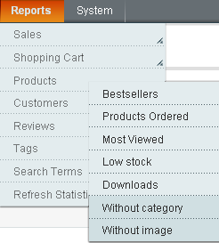
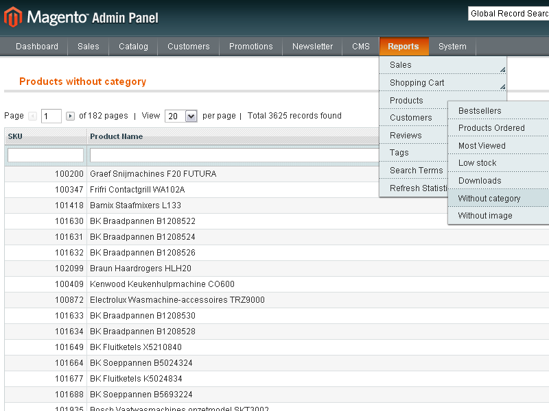
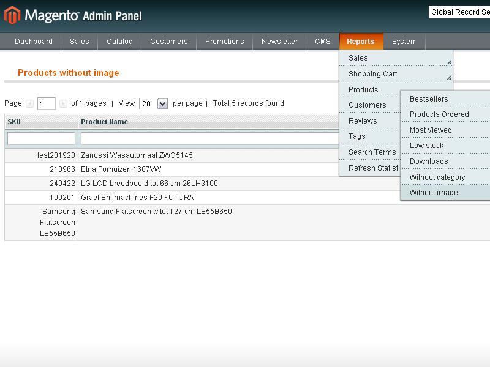

# ISAAC ProductReports Magento module

The ISAAC Product Reports extension provides administrator(s) with two extra product reports that help to keep your catalog healthy. One report shows all products that are not assigned to any category and the other shows all products without images. The products are presented in a grid that supports paging and filtering.



## Features

The following reports are added to the 'Reports | Products' menu of the admin panel:

* ___Without category___: shows all products that are not assigned to any category.
* ___Without image___: shows all products without images.

Each report shows a paged and searchable grid containing the products that match the criteria. When clicking on a link the user is redirected to the corresponding tab or the edit product page.

Translations include English and Dutch.

Compatible with Magento versions 1.4.1 and later.

## Demo / Screenshots




## Installation Instructions

### Installation methods

This module can be installed in various ways: via modman, composer or manually.

#### Modman

1. Install [modman](https://github.com/colinmollenhour/modman)
2. Execute the following command from your Magento installation folder:
```sh
modman clone git@github.isaac.local:magento-module/magento-module-isaac-isaac-product-reports.git
```

#### Composer

1. Install [composer](http://getcomposer.org/download/)
2. Install [Magento Composer](https://github.com/magento-hackathon/magento-composer-installer)
3. Create a composer.json into your project containing the following entries:
```json
{
    ...
    "require": {
        "isaac/magento-product-reports": "*"
    },
    "repositories": [
        {
            "type": "vcs",
            "url": "git@github.isaac.local:magento-module/magento-module-isaac-isaac-product-reports.git"
        }
    ],
    "extra":{
        "magento-root-dir": "."
    }
}
```
4. Execute the following command from yout Magento installation folder:
```sh
composer install
```

#### Manually

Copy the files from the folders of this repository to the same folders of your installation.
Each ISAAC Magento plugin is distributed as a .zip file. You can install the plugin by unzipping the package in the Magento root.

```
cd /path/to/magento
unzip /path/to/isaac_module.zip
```

### Finish installation

After installation:

* Make sure to clear the cache.
* Logout from the admin panel and then login again.